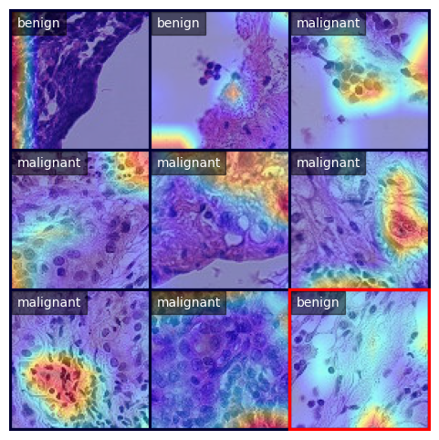

# Project AI For Medical Image Analysis

The following codebase supplements the paper *"Learning to Detect Histopathologic Cancer using Attention"*.



We conduct experiments to investigate the following research questions:
1. Can adding attention to standard vision models improve classification performance?
2. To what extent does attention add to the explainability of the model?

The experiments involve an ablation study on standard vision models, on augmentation techniques, as well as training the final InceptionV3 model with Attention blocks.

To train the final model, run the following command:
```shell
python3 train.py --name attn_inception --model attn_inception
```

---
## Ablation Study: Models
The results of the ablation study are summarised below:
|   **Model**  	    | **AUC** 	    |
|:------------:	    |:-------:	    |
|   MobileNet  	    |   0.87  	    |
| EfficientNet 	    |   0.84  	    |
| **InceptionNet** 	|   **0.89**  	|
|  DenseNet121 	    |   0.87  	    |
|   ResNet34   	    |   0.88  	    |
|   ConvNeXt   	    |   0.87  	    |

To conduct the experiments, modify the `get_transforms()` function in [`utilify_fn.py`](utility_fn.py#124) and set the train transform to `transforms.ToTensor()`. Note that the ablation models were trained with un-augmented data.
### MobileNet
```shell
python3 train.py --name mobilenet --model mobilenet
```
### EfficientNet
```shell
python3 train.py --name efficientnet --model efficientnet
```
### InceptionNet
```shell
python3 train.py --name inception --model inception
```
### DenseNet121
```shell
python3 train.py --name densenet --model densenet
```
### ResNet34
```shell
python3 train.py --name resnet34 --model resnet34
```
### ConvNeXt
```shell
python3 train.py --name convnext --model convnext
```

---
## Ablation Study: Augmentation
The results of the ablation study are summarised below:
|    **Augmentation**    	| **Value** 	| **Accuracy** 	|
|:----------------------:	|:---------:	|:------------:	|
|          None          	|     -     	|     0.56     	|
| Random Horizontal Flip 	|     -     	|     0.61     	|
|  Random Vertical Flip  	|     -     	|     0.74     	|
|        Rotation        	|     90°    	|     0.65     	|
|        Rotation        	|    180°   	|     0.71     	|
|        Rotation        	|    270°    	|     0.57     	|
|         Jitter         	|    0.1    	|     0.73     	|
|         Jitter         	|    0.2    	|     0.71     	|
|         Jitter         	|    0.3    	|     0.56     	|
|         Jitter         	|    0.4    	|     0.53     	|
|         Jitter         	|    0.5    	|     0.61     	|
|      GaussianBlur      	|     3     	|     0.74     	|
|      GaussianBlur      	|     5     	|     0.64     	|
|      GaussianBlur      	|     7     	|     0.69     	|

The final augmentation policy can be found in `utilify_fn.py`, and is listed below:
```py
transform = transforms.Compose([
    transforms.RandomHorizontalFlip(),
    transforms.RandomVerticalFlip(),
    transforms.RandomRotation(180),
    transforms.ColorJitter(brightness=0.1, contrast=0.1, saturation=0.1, hue=0.1),
    transforms.GaussianBlur(3),
    transforms.ToTensor(),
])
```

To conduct the experiments, modify the `get_transforms()` function in [`utilify_fn.py`](utility_fn.py#124) and set the train transform based on these conditions. The experiment can then be started by executing the following command:
```shell
python3 train.py --name aug --epochs 1 --model inception
```

### None
```py
transform = transforms.ToTensor()
```

### Random Horizontal Flip
```py
transform = transforms.Compose([
    transforms.RandomHorizontalFlip(),
    transforms.ToTensor()
])
```

### Random Vertical Flip
```py
transform = transforms.Compose([
    transforms.RandomVerticalFlip(),
    transforms.ToTensor()
])
```

### Rotations
We test the following angles of rotation: `[90, 180, 270]`. We can replace `i` in the below command with each of the aforementioned parameters.
```py
transform = transforms.Compose([
    transforms.RandomRotation(i),
    transforms.ToTensor()
])
```

### Color Jitter
We test the following values for brightness, contrast, saturation and hue: `[0.1, 0.2, 0.3, 0.4, 0.5]`. We can replace `i` in the below command with each of the aforementioned parameters.
```py
transform = transforms.Compose([
    transforms.ColorJitter(brightness=i, contrast=i, saturation=i, hue=i),
    transforms.ToTensor()
])
```

### Gaussian Blur
We test the following values for the kernel size: `[3, 5, 7]`. We can replace `i` in the below command with each of the aforementioned parameters.
```py
transform = transforms.Compose([
    transforms.GaussianBlur(i),
    transforms.ToTensor()
])
```

---
## Metrics
To calculate the confusion matrix and classification report of all models in the log directory, run the following command.
```shell
python3 metrics.py
```

---
## Requirements
```
torch
torchvision
numpy
pandas
opencv-python
seaborn
matplotlib
scikit-learn
```